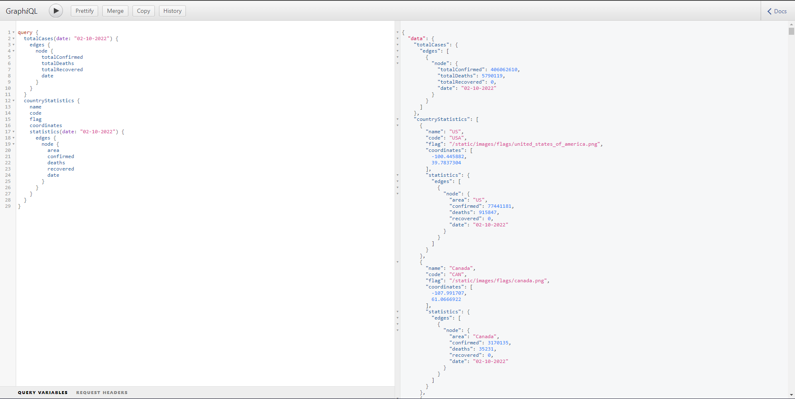

## Overview

The idea behind this web application is to display the statistics of Coronavirus around the world. To get daily results, this website collects 
the data from [Johns Hopkins University Center for Systems Science and Engineering (JHU CSSE)](https://github.com/CSSEGISandData/COVID-19/tree/master/csse_covid_19_data/csse_covid_19_daily_reports) GitHub page.


### Production URL

<a href="https://covid19tracker.info/" target="_blank">
https://covid19tracker.info
</a>

## Technical Overview

TechStack behind covid19tracker website is (Django, Postgresql, GraphQL & Mapbox) and to collect daily results around the world admin panel crawls & 
parses (JHU CSSE) GitHub page using [beautifulsoup4](https://pypi.org/project/beautifulsoup4/) and parses the CSV file using 
[PapaParse](https://www.papaparse.com/) javascript API and converts it to JSON data format and stores the results into the db using ORM data models. 
To populate the statistics of each country around the world over the map it uses [Mapbox](https://www.mapbox.com/) Javascript API and follows geoJSON data 
format to represent the geographic location of each country.  

### Admin Panel

To sync the daily statistics, I have built one Admin Panel which crawls & parses (JHU CSSE) CSV data and updates the results into the database on 
daily basis and the admin panel can be accessed using [/admin](http://127.0.0.1:8000/admin) endpoint.

### Mapbox | Access Token

To get started with the website I have provided one default Mapbox access token which can be found under the [.env.dev](https://github.com/anshumanpattnaik/covid-19-tracker/blob/main/.env.dev#L11) file, but the token has limited 
usage, and I suggest bringing your access token and replacing the value with the following environmental variable.

``````````````````````````````````````````````````
MAP_BOX_ACCESS_TOKEN=YOUR_MAP_BOX_ACCESS_TOKEN
``````````````````````````````````````````````````

### Installation

To make the installation process easier I have set up docker, and internally it handles all installation complexity and configures the statistics of 
the following dates to get started with the website.

- [02-08-2022](data/02-08-2022.json)
- [02-09-2022](data/02-09-2022.json)
- [02-10-2022](data/02-10-2022.json)
- [02-11-2022](data/02-11-2022.json)
- [02-12-2022](data/02-12-2022.json)

Before proceeding further with the installation & setup process, make sure you've docker installed in your local machine. If not then please follow the 
[official documentation](https://docs.docker.com/engine/install/) for installation. 

Once docker is set up in your local environment then follow the following steps for project installation & setup process.

``````````````````````````````````````````````````````````````````
git clone https://github.com/anshumanpattnaik/covid-19-tracker.git

cd covid-19-tracker
docker-compose up -d --build 
``````````````````````````````````````````````````````````````````

Once your container is up and running then execute the below commands to set up all country & statistics data into the database. 
And this setup procedure is essential otherwise you'll face some unintended behaviour while accessing the website.


``````````````````````````````````````````````````````````````````
docker-compose exec web python manage.py makemigrations app
docker-compose exec web python manage.py migrate app
docker-compose exec web python setup.py --noinput
``````````````````````````````````````````````````````````````````

During the setup process, you'll observe the following logs.

``````````````````````````````````````````````````````````````````
Setting Up all countries & statistics data
------------------------------------------

All countries data added to the database successfully
------------------------------------

Statistics
----------
02-08-2022.json data added to the database successfully
02-09-2022.json data added to the database successfully
02-10-2022.json data added to the database successfully
02-11-2022.json data added to the database successfully
02-12-2022.json data added to the database successfully

Setup completed successfully!
Open http://127.0.0.1:8000 on your browser

``````````````````````````````````````````````````````````````````

### GraphQL

To get the statistics faster, I have implemented GraphQL using [graphene](https://pypi.org/project/graphene/) python module, so we can query different datasets `i.e. Country, TotalCases & CovidStatistics` and get all the results at once in just few seconds.

``````````````````````````````````````````````````
Open http://127.0.0.1:8000/graphql on your browser 
``````````````````````````````````````````````````

### Query

This is a sample query to get the covid statistics of the `02-10-2022` date and using this query, it will populate two different sets of data.

1. Total Cases around the world - (totalCases)
2. Statistics of all countries - (countryStatistics)

````````````````````````````````````````````````````
query {
  totalCases(date: "02-10-2022") {
    edges {
      node {
        totalConfirmed
        totalDeaths
        totalRecovered
        date
      }
    }
  }
  countryStatistics {
    name
    code
    flag
    coordinates
    statistics(date: "02-10-2022") {
      edges {
        node {
          area
          confirmed
          deaths
          recovered
          date
        }
      }
    }
  }
}
````````````````````````````````````````````````````
### Output



### Note
The website is still under development, if you've any new ideas or suggestions feel free to reach out to me on 
[@anspattnaik](https://twitter.com/anspattnaik) or you can also raise a PR with the new feature or any bug fixes.

### License
This project is licensed under the [Apache 2.0 License](LICENSE)